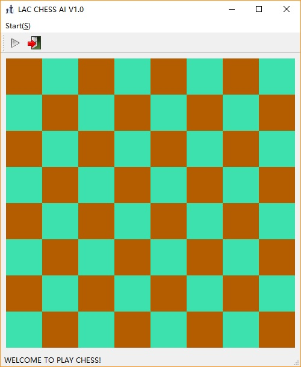
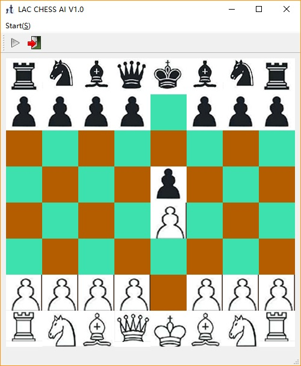

# Simple Chess AI
This is a simple chess AI written in python. Since this is a toy AI, I have removed the rules of shifting between king and castle and eating pawns passing by, so some behavior may be different from the standard ones.
## Requirements
---
Numpy, Opencv and PyQt5. Other packages are only used in debugging.
## Usage
---
python3 main.py
## How to play
---

There are two buttons on the top. Press the left one to start a new game whenever you want, and press the right one to quit this application.
At present, you are always the first to play while the AI plays after you so there may be a sensible lapse.

Enjoy!